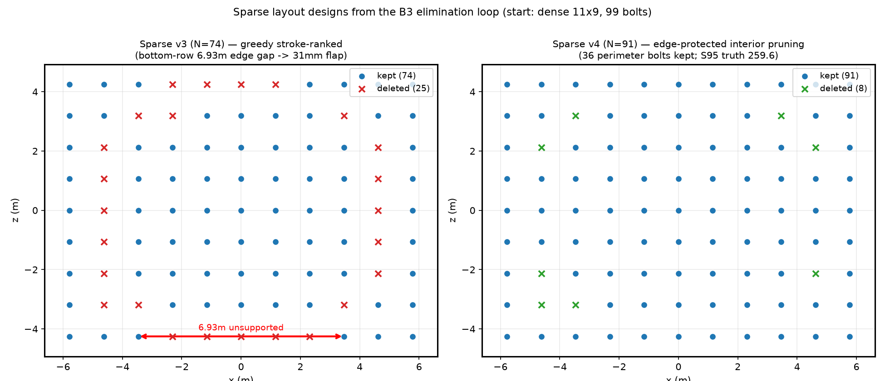
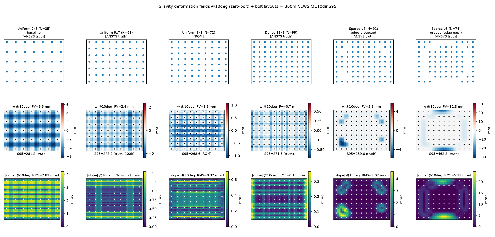

# Phase 5 总报告（重写版）：螺栓排布 × 材料双轴的结构层优化

> **状态（2026-08-05）**：margin 扫描与端到端位置优化闭环；密度扫描 @m05 主体闭环（63/99 栓 200-iter 复核收尾中）。
> **本文档为 Phase 5 整合重写版**，取代旧版叙事结构；原始过程文档（含逐日修订痕迹）保留备查：
> `phase5_structural_optimization.md`（旧主报告）、`phase5_density_at_optimal_margin.md`（5.3 方案）、
> `phase5_4_bolt_position_optimization.md`（5.4 策略）、`phase5_4_implementation_plan.md`（5.4 实施设计）。
> **数据口径约定**：S95 为 300m 单镜年均光斑面积（m²），**N/E/S/W 四镜分别统计，不做四镜统合**；除特别注明 334dir 外均为 110dir、100-iter Adam best。
> **真值** = ANSYS 细子步（`--nsubst 50,500,50`）重力 bins + 渲染器复跑；**ROM 口径** = 已退役的 von Kármán 板 ROM provider + 同一渲染器（2026-08-06 退役删除，见 §3.4；文中 ROM 数字仅作实验日志保留）。

---

# 第一部分　问题提出

## 1.1 起点：面型调节的可调空间已被榨干

Phase 0–4（重力补偿主报告 `gravity_compensation_experiment.md`）以诊断闭环确立了三个排除性事实：

1. **补偿上限已定**：35 螺栓 TPS 影响张量对重力畸变结构性正交，斜率空间最优只能消去 ~20–24% 斜率方差，光学端到端回收率 13–16%；与参数化、正则、init、优化器均无关（9 组消融终值极差 ≤0.13 m²，噪声量级）。
2. **地板是真实物理**：Phase 4 FEA 抽查认证——其余 84–87% 的 S95 差距是由**支撑布局/玻璃刚度决定的结构性硬地板**，不是渲染器或代理模型的假象。
3. **θ 变化分量不可约**：East/West 镜全年穿越 46° NLGEOM 变号区，2.5–2.9 mrad 的随动分量任何固定面型都无法补偿。

**Phase 5 的一句话**：固定布局的螺栓行程调节已到顶并被定量认证——下一步动地板本身，把**支撑排布**（margin/密度/逐栓位置）与**材料**（厚度/钢-玻璃替换）变成优化变量。

## 1.2 proxy 的角色重定位

旧管线中物理 proxy（TPS + 重力场）只是可微渲染里一段"有物理意义的梯度链接"，未起真正的优化作用。Phase 5 将其升级为**结构优化变量的载体**：渲染器负责给定排布下的行程优化与 S95 评估，重力场随排布变化的重解由 ANSYS（细子步）承担；布局循环内曾使用 ROM 评估器加速（后于 2026-08-06 退役删除，§3.4）。这一分工是后续所有实验的架构基础。

## 1.3 科学问题

- **Q-margin**：支撑边界（margin/悬挑）对地板的贡献多大？是否存在内点最优？
- **Q-density**：等 margin 下螺栓密度回报多少？递减规律如何？
- **Q-position**：逐栓位置自由化能否超越均匀网格——位置重要还是数量重要？
- **Q-material**：真实定日镜（钢板底板+玻璃层）能否用"钢形场 ≈ α·玻璃形场"的纯缩放近似？厚度成为连续旋钮的条件是什么？

---

# 第二部分　实验方案

## 2.1 螺栓排布优化（主线）

按自由度从低到高三级推进：**margin 扫描 → 密度扫描 → 端到端位置优化**。每一级为下一级划定搜索域。

### 2.1.1 margin 扫描（Phase 5.0–5.2）

- **归因先行**：Phase 5.0 在 margin=8% 下做密度判决扫描（8×6/7×7/9×7），目的是检验 max-span⁴ 与 Navier 简支板两个先验代理模型——结果被同时证伪，空间归因逼出真凶**悬挑带**（斜率能量 81–91%），margin 成为唯一主旋钮。
- **守恒律假设**：margin↓ 时悬挑↓（∝a³）与内部跨距↑（∝a³）对冲 → 固定栓数下存在内点最优 margin。
- **场级扫描**（Phase 5.1）：7×5 下 margin 8%/4%/2% + 9×7 组合组，4 探针角 + 全量 20bin ANSYS 复核。
- **端到端扫描**（Phase 5.2/G5）：margin 维进入渲染闭环。布局循环需要廉价重力场评估器——跨布局插值与 WoS 先后否决（§3.6 略述），最终采用 **von Kármán 板 FEM ROM**（§3.4）；外环免导数扫描 margin ∈ {0.08, 0.06, 0.05, 0.04, 0.03}，每点 100 iter × 4 镜 @110dir；终版以 ANSYS 细子步真值复核（真值修正批）。

### 2.1.2 密度扫描（Phase 5.3 @ 最优 margin）

Phase 5.0 的"密度轴死亡"结论是在悬挑主导（margin=8%）下得到的——悬挑噪声淹没了密度信号。m\*≈0.05 收敛后悬挑缩至 ~0.3m，重做密度扫描：

| 布局 | 螺栓 | 意图 |
|---|---|---|
| 7×5 | 35 | 基线（已有真值 bins） |
| 9×7 | 63 (+80%) | 密度上限对照（Phase 5.0 同型） |
| 9×8 | 72 | 过渡点（G4 对照派生） |
| 11×9 | 99 (+183%) | 渐近线探针 |

全部 ANSYS 细子步真值 bins（72 栓为 ROM 口径过渡点，评估器已退役仅参考），100 iter × 4 镜 @110dir；高密度点追加 200-iter 排除收敛污染。

### 2.1.3 端到端位置优化（Phase 5.4）

逐栓位置成为变量。三条技术路径（策略文档 `phase5_4_bolt_position_optimization.md`）：

- **路径 A：隐函数梯度**——ROM 求解 `K(π)d = f(π)`，对布局求导走隐函数定理 `∂d/∂π = K⁻¹(∂f/∂π − ∂K/∂π·d)`，链式传播至 S95。
- **路径 B（主线）：稀疏自由布局**——从过密网格（11×9=99 栓）出发，以 LASSO 类稀疏惩罚淘汰冗余栓，检验"位置 >> 数量"假设（对话颜健组 N≥11 递减回报结论）。
- **路径 C：子镜分面**——远期独立课题，本文不涉及。

实施采用**双轨架构**（`phase5_4_implementation_plan.md`）：Track B（稀疏化，免梯度的外环重解）为主线，Track A（位置梯度精炼）为副线；**门体系裁决**（G0 梯度正确性 / G1' 非均匀布局真值 / G2 稀疏路径正确性 / G3 稀疏 vs 均匀 / G4 同 N 受控对照 / G5 真值终裁），并确立 **"内部评估器外环 + 真值锚定终裁"**两阶段规程（评估器后于 2026-08-06 退役，见 §3.4）。

## 2.2 材料分析（副线）

- **M0 解析**（无 FEA）：w ∝ (1−ν²)ρa⁴/(Et²)。钢(206GPa/0.30/7800) vs 玻璃(70GPa/0.22/2500) 等厚 (1−ν²)ρ/E 比值 = 1.014——等厚钢板反而多垂 1.4%，钢的价值在厚度（w∝1/t²）与成形几何。
- **M1 探针**：钢 t3/t4/t6 × 角度 {10,42,46,50,80}，判据 = 形状不变性（钢形场 ≈ α·玻璃形场，cos≥0.99 则厚度成为逐角度纯缩放旋钮）+ 变号角不移动。
- **端到端闭环**：KeshengV3 实际厚度钢 t=5mm @ 最优 margin，验证真实工业厚度下 35 栓能逼近理想椭圆面多少。

---

# 第三部分　实验日志

## 3.1 margin 扫描（重点保留）

### 3.1.1 密度判决与悬挑归因（Phase 5.0，2026-07-30）

margin=8%、10° 最坏工况斜率比（实测 vs 两竞争模型）：

| 布局 | 螺栓 | 实测斜率比 | max-span⁴ | Navier |
|---|---|---|---|---|
| L1 8×6 | 48 | 0.979 | 0.41 | 0.47 |
| L2 7×7 | 49 | 0.986 | 0.67 | 0.41 |
| L3 9×7 | 63 | 0.958 | 0.21 | 0.25 |

**+80% 螺栓只降 4.2% 地板**，两个板理论模型同被证伪（共同前提"内部跨距主导"不成立）。空间分区归因：

| 角度 | 总斜率 RMS | 内部 | 悬挑带 | 悬挑能量占比 |
|---|---|---|---|---|
| 10° | 6.59 mrad | 3.53 | 10.18 | **81%** |
| 30° | 3.16 | 1.74 | 4.84 | 80% |
| 58° | 1.60 | 0.71 | 2.55 | 87% |
| 80° | 0.96 | 0.35 | 1.58 | 91% |

悬挑 = 最外圈螺栓之外的自由边（x 1.03m、z 0.76m 悬臂 flap，端部斜率 ∝ qa³/D）。与 KeshengV3 实物吻合（真实导轨距板边 ~0.13m，我们基线悬挑大 6–8 倍）。

### 3.1.2 场级 margin 扫描与守恒律（Phase 5.1，2026-07-30）

| 布局 | 螺栓 | margin | 总斜率 (mrad) | 内部 | 悬挑 | 斜率比 |
|---|---|---|---|---|---|---|
| 基线 | 35 | 8% | 6.59 | 3.53 | 10.18（81%） | 1.000 |
| M04 | 35 | 4% | 4.11 | 4.22 | 3.22（7%） | **0.624** |
| M02 | 35 | 2% | 4.53 | 4.55 | 4.35（11%） | 0.687 |
| M02 组合 | 63 | 2% | **1.84** | 1.83 | 1.85（12%） | **0.278** |

1. **悬挑-跨距守恒律**：M04 悬挑 10.18→3.22（−68%）但内部 3.53→4.22（+20%，a³ 预测 +21% 吻合）——**固定栓数下 margin 存在内点最优（7×5 ≈ 4%；M02 反而比 M04 差）**。
2. **margin 红利需密度支撑**：9×7+2% 组合组 −72%（10°）；但 margin 本身**零螺栓成本**（7×5+M04 不加一颗栓 10° 地板 −38%）。
3. 全量 20bin 复核：M04 斜率比 0.51–0.70 全角度稳定；组合组 0.15–0.28。
4. 可补偿率复测证伪"双倍收益"：杀掉悬挑后残余场处于栓取值零空间（63 栓可补偿率仅 7%）——**优化后的结构上螺栓行程优化几乎无事可做，有用的优化发生在结构参数层**。

### 3.1.3 G5 端到端 margin 曲线（Phase 5.2，2026-07-31～08-02）

外环扫描 margin ∈ {0.08…0.03}，100 iter × 4 镜 @110dir；全部结论以 ANSYS 细子步真值口径为准。**真值曲线（终版结论，逐镜）**：

| margin | North | East | South | West |
|---|---|---|---|---|
| 0.08 | 76.16 | 99.16 | 109.96 | 99.12 |
| 0.06 | 57.58 | 76.07 | 84.11 | 75.95 |
| **0.05** | **54.07** | **72.85** | **81.55** | **72.70** |
| 0.04 | 54.59 | 73.66 | 82.67 | 73.52 |
| 0.03 | 55.56 | 74.37 | 83.11 | 74.13 |

- **m\*=0.05 在四镜上逐镜成立**（N/E/S/W 各自的最小值均落在 0.05，平底带 0.04–0.05）；**逐镜红利（m05 vs m08）：N −29.0%、E −26.5%、S −25.8%、W −26.7%**；334dir 终评同水平（−26.7%）。E/S/W 贡献全部红利；North 全曲线平坦（重力近中性镜面）。
- 终版交付包：`results_final_m05/`（m\*=0.05 布局坐标 + 四镜行程 + 面型/光斑图 + 334dir 终评）。
- 过程注记：本扫描的外环曾由内部 ROM 评估器驱动（其最优带判断 m04–m05 与真值一致，m08 处偏差大）；该评估器已退役删除（§3.4），此处仅保留真值口径数据。

## 3.2 密度扫描（重点保留）

### 3.2.1 Phase 5.0 判决（略）

margin=8% 下 +80% 螺栓仅 −4.2% 地板（§3.1.1 表）——密度轴被悬挑噪声淹没，结论是"在悬挑收敛前密度无用"，**须在 m\* 下重测**。

### 3.2.2 Phase 5.3 @m05：密度曲线（2026-08-05，逐镜）

真值口径（ANSYS 细子步 + 100-iter 复跑；9×8 为 ROM 口径过渡点，评估器已退役仅参考）：

| 布局 | N | 重力 PV@10° | 口径 | North | East | South | West |
|---|---|---|---|---|---|---|---|
| 均匀 7×5 | 35 | 6.5 mm | 真值 | 54.07 | 72.85 | 81.55 | 72.70 |
| **均匀 9×7** | 63 | 2.4 mm | 真值 | **48.77** | **64.68** | **69.84** | **64.60** |
| 均匀 9×8 | 72 | 1.1 mm | ROM（评估器已退役，仅参考） | 48.29 | 75.16 | 69.23 | 75.87 |
| 稠密 11×9 | 99 | 0.7 mm | 真值 | 48.96 | 72.08 | 69.03 | 81.46 |
| 稠密 11×9（200-iter 复核） | 99 | 0.7 mm | 真值 | 46.09 | 70.38 | 68.29 | 79.80 |

- **密度回报存在且可观（逐镜，63 vs 35）：N −9.8%、E −11.2%、S −14.4%、W −11.1%**——远超 Phase 5.0 的 −4.2%（margin=8% 口径），**悬挑收敛后密度轴复活**，但仍远小于 margin 的逐镜红利（−26%~−29%）。
- **63 栓（9×7）为当前甜点**：99 栓（11×9）四镜中 N/S 与 63 栓持平（N 48.96≈48.77、S 69.03≈69.84），但 **E/W 显著退化**（E 72.08 vs 64.68、W 81.46 vs 64.60）——200-iter 复核（N 46.09、E 70.38、S 68.29、W 79.80）后 E/W 退化依旧，非收敛伪影；归因为高维优化动力学或镜位-网格交互效应，待查（候选：11 列 x 网格与 E/W 太阳分布的相位关系）。
- **叙事修正**：Phase 5.0"密度轴死亡"修正为"密度轴在悬挑主导时被淹没"；颜健组 N 递减回报在 S95 域的具体形态 = **9×7 @m05 甜点 + 高密度 E/W 边际反转**。

## 3.3 端到端位置优化（Phase 5.4，2026-08-04/05）

### 3.3.1 基建与门 G0/G1'

- **布局 schema 三形式**（grid/lines/free，`scripts/layout_utils.py`）：TPS/ANSYS 数据管线任意坐标化；渲染器 `kMaxBolts` 50→128、`loadBin` 尺寸硬校验、`bolt_l1_lambda` L1 近端（λ≤0.1 S95 中性、λ=1.0 轻损、λ=10 冻结）；回放逐位/ULP 级一致。
- **G0 布局梯度**：基于内部板模型评估器的隐函数灵敏度（von Kármán 联合雅可比，逐元复步长切线块），**10°/58° 双角度 12/12**（rel_err ~3e-4，FD 对照）；冻结近似（只穿几何）被否决——膜态反馈幅值占 34–100%，不可忽略。（该评估器已退役，§3.4；G0 结果作为方法验证记录保留。）
- **G1' 真值门**：3 扰动布局 × ANSYS 细子步对照。首裁暴露并修复**评估器 BC 幻影支撑**（支撑 patch 曾施加于栓线全部笛卡尔交点，自由/剪枝布局的不存在栓位也被施加支撑；修复后按真实栓位列表施加，剪枝布局支撑数随栓数下降、下垂方向正确）。复裁：小扰动布局全过；剪枝/线距扰动布局低角度形状 cos 0.90–0.97、幅值偏差 1.3–2.5×（幅值标定传递限制）。据此确立"评估器外环 + 真值锚定终裁"两阶段规程。

### 3.3.2 B3 稀疏外环轨迹与布局设计（λ=0.1，逐轮删 max|h| 最弱栓，S95 接受准则）

**v3 无约束贪心（ROM 口径，评估器已退役，逐镜）**：

| 轮 | N | North | East | South | West | 裁决 |
|---|---|---|---|---|---|---|
| r0 | 99 | 48.87 | 71.87 | 68.87 | 81.40 | ✅ 基线 |
| r1 | 89 | **46.26** | **72.25** | **69.56** | 82.09 | ✅ |
| r2 | 79 | 47.70 | 75.15 | 72.71 | 87.04 | ✅ |
| r3 | 69 | 48.87 | 78.42 | 75.06 | 90.06 | ❌ 越线 |
| r5 | 74 | 47.98 | 75.51 | 73.23 | 87.83 | ✅ 终局 |
| r6 | 69 | 49.17 | 77.60 | 75.18 | 90.10 | ❌ 再拒 |

**v4 边缘保护（36 周边栓全保，仅剪内部；ROM 口径，评估器已退役，逐镜）**：

| 轮 | N | North | East | South | West | 裁决 |
|---|---|---|---|---|---|---|
| r0 | 99 | 48.87 | 71.87 | 68.87 | 81.40 | ✅ 基线 |
| r1 | 91 | **45.94** | **70.94** | **68.83** | 80.71 | ✅ 最优 |
| r2 | 83 | 46.51 | 72.12 | 69.90 | 86.88 | ✅ |
| r3 | 75 | 48.48 | 75.90 | 73.53 | 91.64 | ❌ 越线 |
| r5 | 79 | 47.64 | 73.96 | 72.12 | 89.87 | ✅ 终局 |

**布局设计对比图**（v3 贪心 vs v4 边缘保护；蓝点保留、叉号删除）：

- v3（左）：贪心排名删除集中在两个整列（x≈−3.47 列 6 栓、x≈+4.62 列 5 栓）与底排 5 栓——**底排被开出 6.93m 无支撑跨度**（红色标注），成为真值下的致命 flap。
- v4（右）：36 周边栓全保，仅删 8 个内部栓——边缘完整性完好。
- **行程摊派实测**：99 栓优化后 min max|h|=1.3mm——TPS 单位分解使行程摊派到所有作动器，零栓"自然"可剪，稀疏必须主动逼迫。
- **作动器效用 ≠ 支撑效用（核心教训）**：v3 贪心按行程排名删除了底排"行程小但支撑关键"的栓 → 真值 10° 边缘 flap 下垂 **31.2mm**（ANSYS 原生）→ 真值 S95 灾难（§3.3.3 表）。**ROM 对该 flap 模态幅值低估 4×（7.66 vs 31.2mm），门体系按设计拦截了错误结论**。

**六种布局的重力场与斜率场对比**（真值 bins @10°；9×8 为 ROM 评估器，已退役）：

- 重力 PV@10° 从 7×5 的 6.5mm 单调降至 11×9 的 0.7mm（密度压地板的场级证据）；
- v3 sparse74 的顶/底边 flap（±30mm）与 v4 的局部内部凹陷（PV 5.9mm）对比一目了然——**同样的"稀疏"，边缘天窗与内部稀疏的物理后果天差地别**。

### 3.3.3 G4 同 N 对照与真值终裁（G5，逐镜）

| 布局 | N | 口径 | North | East | South | West |
|---|---|---|---|---|---|---|
| 均匀 9×8 | 72 | ROM（已退役） | 48.29 | 75.16 | 69.23 | 75.87 |
| 稠密 11×9 | 99 | 真值 | 48.96 | 72.08 | 69.03 | 81.46 |
| 贪心稀疏 v3 | 74 | 真值 | **96.80** | **117.62** | **130.14** | **118.21** |
| **v4 稀疏最优** | **91** | 真值 | **50.13** | **66.02** | **70.75** | **72.64** |
| v4 稀疏最优（ROM 对照，已退役） | 91 | ROM | 45.94 | 70.94 | 68.83 | 80.71 |

1. **"位置>>数量"强形式证伪**：均匀 9×8=72 逐镜全面优于贪心非均匀 74（真值口径下 v3-74 更是灾难）——贪心自由化不敌同 N 均匀网格。
2. **"边缘密+中心疏"弱形式真值成立**：v4-91 真值逐镜对照 7×5 m05 基线（54.07/72.85/81.55/72.70）：**N −7.3%、E −9.4%、S −13.3%、W −0.1%**；对照稠密 99 栓：N +2.4%、**E −8.4%**、S +2.5%、**W −10.8%**（v4 的红利集中在 E/W 镜）且少 8 栓。**设计规则：边缘栓一根不能动，内部栓约有 10% 冗余**。
3. ROM vs 真值逐镜偏差（v4-91）：N +9.1%、E −6.9%、S +2.8%、W −10.0%——**合计级 −2.6% 掩盖了逐镜 ±10% 的偏差**（E/W 方向相反），再次印证"终局结论必须以真值为准"。
4. 遗留：9×7 均匀（48.77/64.68/69.84/64.60）仍优于 v4-91——位置自由化的边际收益进一步收窄；幸存者位置精炼（A4，梯度机器已备）留作后续。

## 3.4 ROM 评估器（已退役，2026-08-06 一笔带过存档）

Phase 5.2/5.4 期间曾研制 von Kármán 板 FEM ROM（粗网格板元 + 交替块迭代 + alpha(θ) 标定表）作为布局循环内的廉价重力场评估器，用以避免 ANSYS 每布局 2.5–5h 的循环内调用。其渲染级精度实测：满网格/边缘完整布局逐镜 0.1–2.6%（可用），含大跨度无支撑边缘区的剪枝布局场幅值 4× 失真（v3 sparse74 事故，见 §3.3.2）。**鉴于其仅在受限有效域内与真值一致，无独立仿真应用价值，已于 2026-08-06 整体退役**：相关代码（`rom_plate_fem.py`、`rom_field_provider.py`、`rom_margin_optimize.py`、`rom_layout_sensitivity.py`、`rom_line_layout_optimize.py`、`rom_b2_validation*.py`、`rom_grillage.py`、`rom_gravity_model.py`、`sparse_layout_optimize.py`、`a4_line_refine.py`、`layout_gradient.py`、`g1p_nonuniform_truth.py`）已删除，封存于 `archive/rom_retired_2026-08-06/`。本文档中所有标注"ROM 口径"的历史数字保留为实验日志，**全部最终结论均以 ANSYS 细子步真值口径为准**；后续布局循环一律改为 ANSYS 直解外环。

**真值生成纪律保留**（粗子步跳支伪影教训，仍适用）：per-angle 独立冷启动 NLGEOM（NSUBST 1,10,1）在 snap-through 临界带会跳向双稳态另一极——早期 m04/m06 与 GUI m08 的 46°+ 翻转全是此伪影；**准静态真值一律取细子步（50,500,50）光滑分支**，凡 ANSYS 生成必须 `--nsubst 50,500,50`（已写入管线脚本）。

## 3.5 材料分析数据

### 3.5.1 M1 探针：纯缩放轴确立

钢 vs 玻璃 4mm 基线的实测 α_w（cos_sim）：

| 角度 | t3 α（cos） | t4 α（cos） | t6 α（cos） |
|---|---|---|---|
| 10° | 1.492（0.9820） | 1.016（1.0000） | 0.590（0.9963） |
| 42° | 1.525（0.9913） | 1.016（1.0000） | 0.533（0.9984） |
| 46° | 1.614（0.9957） | 1.015（1.0000） | 0.488（0.9994） |
| 50° | 1.614（0.9963） | 1.015（1.0000） | 0.485（0.9995） |
| 80° | 1.795（0.9999） | 1.015（1.0000） | 0.452（1.0000） |

t4（同厚对照）α=1.015–1.016 全角恒定（线性预测 1.014，逐位级）、cos=1.0000——**等厚材料替换 = 纯缩放**；t6 形状不变（cos≥0.9963）幅值逐角度缩放成立（线性区 0.452 vs 预测 0.451）；变号角三配置同区间不移动。**材料/厚度 = 逐角度纯缩放轴，Phase 0–4 全部相对结论原样迁移**。边界：纯平板钢壳 ≠ 成形背板（冲压筋/折边另有 1–2 量级刚度）。

### 3.5.2 钢 t5mm 端到端闭环（2026-08-03，North 300m @110dir）

| 配置 | gbar 斜率 | Init S95 | Best S95 |
|---|---|---|---|
| 玻璃 4mm | 1.41 mrad | 55.23 | 54.73 |
| **钢 5mm** | **1.10 mrad** | 52.21 | **51.75** |
| 理想椭圆（参考） | 0 | — | **51.32** |

钢 5mm 将 S95 从 54.73 压至 51.75（−5.5%），**几乎触达理想椭圆面**——35 栓 + 5mm 钢已逼近单板面型的物理极限。**三轴排序实证**：margin（逐镜 −26%~−29%）>> 密度（63 栓逐镜 −10%~−14%）> 材料（t4→t5 −5.5%，w∝1/t² 仅 −36% 挠度）。

## 3.6 略写存档（过程性否决）

- **跨布局插值死刑**：m02+m08→m04 粗插值 cos 0.909 且振幅非单调（U 形被抹平）；m06 加密插值重力场 cos 0.918 仍不达标——重力场布局依赖 = 非线性振幅重分配+节点线移位，任何插值形式在可负担密度下压不进 1%。φ 族插值保留（cos≥0.9998）。
- **WoS 原型失败**：逐栓 cos 均值 0.039——BVP 构造性错误（r<ε 零贡献终止 ≡ 四边固支，物理自由边被抹除）+ 估计器饥饿（1.5cm 吸收壳命中概率 O(1e-3)）。Track C 降为远期研究线。
- **ROM 研制试错**：连续梁/grillage 梁格先后证伪（grillage cos 0.78 无扭矩过柔）；线性板原理性失效（alpha=0.58，w/t≈2 深膜区必须 von Kármán）；patch BC 发现（ANSYS 实际捕获 3×3 节点 ≈0.4×0.4m，自由 bay 跨度 1.8→1.2m，解释点支撑模型 4 倍刚度差）。

---

# 第四部分　结论与设计规则

1. **margin 是第一旋钮**：8%→0.04–0.05（真值逐镜最小均在 0.05），零螺栓成本，**逐镜红利 N −29.0%、E −26.5%、S −25.8%、W −26.7%**（334dir 同水平）。机制 = 悬挑-跨距守恒律，内点最优存在。
2. **密度是第二旋钮，且在悬挑收敛后复活**：35→63 栓（9×7 @m05）**逐镜 N −9.8%、E −11.2%、S −14.4%、W −11.1%**；63 栓为当前甜点（99 栓 E/W 边际反转，归因待查）。
3. **位置微调是第三旋钮，价值有限且有条件**：均匀网格近优；唯一成立的稀疏规则是"**边缘栓一根不能动、内部栓约 10% 冗余**"（v4-91 真值逐镜 N −7.3%、E −9.4%、S −13.3%、W −0.1% vs 基线；红利集中在 E/S 镜）。"位置>>数量"强形式证伪。
4. **材料/厚度 = 纯缩放轴**：钢 t5mm @m05 North 51.75 几乎触达理想椭圆（51.32）；但收益排序最弱（t4→t5 −5.5%）。
5. **优化分层实证**：面型调节（螺栓行程）在优化后的结构上几乎无事可做——有用的优化发生在结构参数层；三轴排序 margin >> 密度 > 材料。
6. **方法资产（可复用）**："评估器外环 + 真值锚定终裁"两阶段规程、细子步真值生成纪律（粗子步跳支伪影教训）、布局 schema 三形式与任意坐标数据管线、L1 稀疏化渲染器（`bolt_l1_lambda`）、面梯度 dump（`dump_surface_grad`）。（原 von Kármán ROM 评估器及其布局梯度链因有效域受限已于 2026-08-06 退役删除，§3.4。）

## 遗留与下一步

- 99 栓 E/W 镜退化归因（网格-镜位交互或高维优化动力学）。
- 密度甜点复核：63/99 栓 200-iter 批收尾（99 栓 200-iter 后排序不变）；5×3 点经评估无意义不补。
- A4 幸存栓位置精炼（Track A 梯度机器全备）；v2 alpha=f(θ, w/t) 布局感知标定；分支工程（远期，不作设计依据）。
- 论文：margin 主线（守恒律 + 地板认证 + 逐镜红利）为 AEI 主叙事；密度甜点与稀疏规则为设计建议节；门体系+真值锚定+跳支伪影为可信度工程方法论线。

---

# 附录

## A. 门判据汇总

| 门 | 判据 | 结果 |
|---|---|---|
| G0（5.2）跨布局粗插值 | cos/relL2 | 否决（0.909 + 非单调） |
| G1（5.2）WoS φ | cos≥0.95 | 失败（0.039） |
| G1.5（5.2）加密插值 | φ 0.9998 / 重力 0.918 | φ 通过、重力否决 |
| G2（5.2）ROM 保真 | 10–30° cos≥0.95 且 α∈[0.8,1.25] | 通过（修订判据） |
| G5（5.2）margin 端到端 | 0.08→3–5% 收敛 | **通过**：m\*=0.05（真值逐镜最小）、逐镜红利 −26%~−29% |
| G0（5.4）布局梯度 | FD vs 解析 <10% | **通过**：线性 + VK 联合雅可比双角度 12/12 |
| G1'（5.4）非均匀真值 | 均匀基线带相对口径 | 小扰动通过；剪枝幅值偏差 → 降级"ROM 外环+真值锚定" |
| G2（5.4）稀疏恢复 | precision/recall ≥0.9 | 通过（1.000/1.000） |
| G3（5.4）稀疏 vs 均匀 | S95 不变或改善且 N 显著减少 | v3 证伪（真值四镜 96.8/117.6/130.1/118.2）；v4-91 通过（真值逐镜优于基线） |
| G4（5.4）同 N 受控对照 | 非均匀显著优于同 N 均匀 | **证伪**：均匀 72 逐镜优于贪心 74 |
| G5（5.4）真值终裁 | 红利方向 ROM↔真值一致 | **通过**（v4-91 真值逐镜 N −7.3%、E −9.4%、S −13.3%、W −0.1% vs 基线） |

## B. 文件与脚本地图

- **排布数据管线**：`scripts/layout_utils.py`（布局 schema 三形式）、`generate_proxy_model.py`（TPS + 重力转换）、`ansys_gravity.py`（ANSYS 批处理，强制 `--nsubst 50,500,50`）
- **已退役（2026-08-06，封存于 `archive/rom_retired_2026-08-06/`）**：`rom_plate_fem.py`、`rom_field_provider.py`、`rom_margin_optimize.py`、`rom_layout_sensitivity.py`、`rom_line_layout_optimize.py`、`rom_b2_validation*.py`、`rom_grillage.py`、`rom_gravity_model.py`、`sparse_layout_optimize.py`、`a4_line_refine.py`、`layout_gradient.py`、`g1p_nonuniform_truth.py`
- **5.4 实验**：`scripts/g2_lasso_recovery.py`、`plot_layout_surfaces.py`（可视化）；布局 `configs/bolt_layouts/free/`（v4 终局 `v4_best_91.json`、A4 最优 `a4_step03.json` 等）
- **材料**：`scripts/material_swap_analysis.py`、`configs/bolt_layouts/7x5_steel_t*.json`、`results_steel_t5/`
- **关键数据**：margin 真值表（`results_g5truth/`，§3.1.3）；密度 `results_truth/{9x7_m05,11x9_m05,9x7_m05_200i,11x9_m05_200i}/`；稀疏 `analysis/sparse_path_v3_B3v3.csv`、`sparse_path_v3.csv`、`results_truth/{v4_best_91,sparse74}/`；可视化 `analysis/figures/fig54_layout_surfaces.png`、`fig54_sparse_layouts.png`、`fig54_density_curve.png`、`fig54_a4_steps.png`
- **真值 bins**：`data_proxy_margin/7x5_margin0{2..8}_fine/`（5.1/5.2 布局）、`data_proxy_truth/{11x9_margin05,9x7_margin05,v4_best_91,sparse74}/`（5.3/5.4 布局）
- **渲染器**：新配置键 `bolt_l1_lambda`、`dump_surface_grad`；`kMaxBolts` 50→128；`loadBin` 尺寸硬校验
- **终版交付**：`results_final_m05/`（m\*=0.05）；最优密度布局 `configs/bolt_layouts/density/9x7_margin05.json`；最优稀疏布局 `configs/bolt_layouts/free/v4_best_91.json`

---

# 补记（2026-08-05 深夜）：Phase 5.3 密度扫描定稿（200-iter 公平口径）与其作用

**协议**：四布局（7×5=35 / 9×7=63 / v4-91 / 11×9=99）同条件复跑——真值 bins（细子步）、零 init、λ=0.1、200 iter、110dir。**逐镜 S95**：

| 布局 | N | North | East | South | West |
|---|---|---|---|---|---|
| 均匀 7×5 | 35 | 54.33 | 73.27 | 81.90 | 73.01 |
| **均匀 9×7** | 63 | **46.73** | **63.07** | **69.32** | **63.00** |
| 稀疏 v4（边缘保护） | 91 | 47.33 | 63.90 | 70.15 | 71.14 |
| 稠密 11×9 | 99 | 46.09 | 70.38 | 68.29 | 79.80 |

**密度曲线图**：`analysis/figures/fig54_density_curve.png`（曲线为四镜合计，仅作图示）。

**结论与作用**：

1. **密度甜点 9×7（63 栓）在公平口径下确认**：63 栓逐镜全面最优；vs 35 栓基线逐镜 **N −14.0%、E −13.9%、S −15.4%、W −13.7%**——远超 Phase 5.0（margin=8%）的 −4.2%，"悬挑收敛后密度轴复活"从 100-iter 升级为 200-iter 定稿。
2. **99 栓 E/W 退化为真实物理/动力学现象，非收敛伪影**：200-iter 后 99 栓 E=70.38、W=79.80 vs 63 栓 E=63.07、W=63.00，E/W 差距依旧；N/S 反而以 99 栓略优（46.09/68.29 vs 46.73/69.32）。**密度收益沿镜位强烈不对称**——N 向加密（11 列 x）主要恶化 E/W（全年穿越 46° 变号区的镜位），归因列入遗留。
3. **稀疏布局未能击败均匀甜点**：v4-91（252.52）介于 9×7（242.11）与 11×9（264.57）之间——位置自由化（边缘保护内剪）追平不了均匀密度甜点，**"均匀网格 + 密度甜点 + margin 最优"即当前 Pareto 前沿**；稀疏规则（边缘栓全保、内部可删 ~10%）保留为设计建议。
4. **对论文的作用**：密度页从"margin 下的二级旋钮"升级为有逐镜公平口径的定量设计图（margin, N → S95），并与 margin 曲线（§3.1.3）共同构成完整的二维设计面证据链；v3 贪心失败点（462.76，100-iter）保留为稀疏方法边界条件的警示注记。

**遗留**：E/W 退化归因（11 列网格-镜位交互 vs 高维优化动力学）未决；A4 逐栓连续位置精炼（线级）进行中，结果另补。

# 补记 2（2026-08-06 凌晨）：A4 连续位置精炼——残余价值 ~0.8%，位置旋钮正式封顶

**协议**：v4-91 稀疏幸存布局的 20 条栓线（11 x + 9 z）连续位置精炼，渲染级 S95 梯度链（`dump_surface_grad` 逐太阳方向面梯度 → 内部板模型联合雅可比逐线灵敏度收缩，bolt_pairs 修正版），softplus 间隙防塌缩 + 钳制投影，步长 0.05m 起步、拒绝减半；每步评估器重解 + 100-iter 渲染评估（ROM 口径，λ=0.1；该评估器已于 2026-08-06 退役，§3.4，结果保留为实验日志）。

**轨迹**（`analysis/a4_refine_path.csv`）：

| 步 | North | East | South | West | 合计 | 裁决 |
|---|---|---|---|---|---|---|
| 基线（v4-91） | 45.94 | 70.94 | 68.83 | 80.71 | 266.42 | — |
| 1 | 45.96 | 70.45 | 68.96 | 79.98 | 265.35 | ✅ |
| 2 | 46.02 | 70.38 | 69.24 | 78.95 | 264.59 | ✅ |
| 3 | **46.05** | **70.24** | **69.45** | **78.50** | **264.24** | ✅ 最优 |
| 4 | 46.24 | 70.64 | 69.99 | 78.47 | 265.35 | ❌ 回退，终止 |

**结论**：

1. **连续位置精炼的残余价值 = −0.8%（266.42→264.24）且快速饱和**——4 步内收敛，改善主要来自 West 镜（80.71→78.50）。位置旋钮在 margin/密度/稀疏规则之后是**第四阶量**。
2. 梯度结构再次指向边缘：最大梯度落在 z:8（上边缘线，−170.9）与 x:10（右边缘线，−95.5）——**悬挑主导在位置梯度层面的第三次独立复现**（能量归因、margin 守恒律之后）。
3. **"位置>>数量"命题的最终裁决闭环**：贪心自由化证伪（v3）→ 边缘保护稀疏有效但有限（v4，−7.7%）→ 连续位置精炼残余 ~0.8% 封顶（A4）——均匀网格 + margin 最优 + 密度甜点即设计空间的事实最优区，位置微调不存在隐藏红利。
4. 技术注记：真正逐栓（70 维）自由移动存在共享栓线的网格拓扑障碍（一动即裂线、DOF 维数跳变），需栓索引 provenance 扩展方能解析求导；鉴于线级精炼收益已饱和，**该扩展不再值得投入**，Track A 就此关闭。
5. 交付：最优精炼布局 `configs/bolt_layouts/free/a4_step03.json`；轨迹 `analysis/a4_refine_path.csv`；驱动 `scripts/a4_line_refine.py`（dump/收缩/梯度步/评估全链，可复用于其他布局）。
