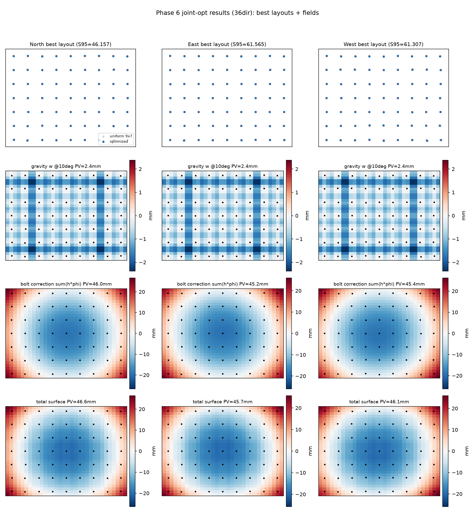

# Phase 6 方案：栓位 × 行程联合端到端优化（pos + height joint optimization）

> **状态**：已收口（2026-08-07，情景 C 修订版）。方案设计 2026-08-06，执行与结论见文末「Phase 6 实验结果」节。前置：Phase 5 闭环（margin 甜点 m05、密度甜点 9×7、稀疏规则"边缘不动+内部可删"、A4 线级精炼残余 0.8% 封顶）；ROM 评估器已退役（§3.4，archive/rom_retired_2026-08-06/）。
> **用户命题**：从中心对称的初始布局出发，对 Nb 根螺栓的**位置 (x_b, z_b) 与顶升高度 h_b 同时做端到端优化**；期望产出**随镜位（NEWS）不同的非对称布局**；继承 Phase 5 结论（margin 尽量小、密度尽量高）。

---

## 1. 目标与核心假设

**目标**：min over (h, π) of 年均 S95，其中 h∈R^Nb（行程）、π∈R^(2·Nb)（逐栓坐标）。联合、可微、端到端。

**科学假设**（由 Phase 5 证据支撑）：
1. E/W 镜全年穿越 ~45° 重力变号区、N 镜近中性——**重力-光学耦合沿镜位不对称** → 最优支撑排布应当随镜位不对称（如向重力主导侧加密/偏移）。（注：变号区理论值 ≈45°；此前文档写作 46° 仅因 ANSYS 角度分箱（42°/46°/50°）恰好取到 46° 作考察基准，并非物理点。）
2. Phase 5 只动了"删哪些栓"（组合）和"整线平移"（12/20 DOF），从未让单栓自由——**逐栓自由化是最后一个未榨干的自由度**。A4 的 0.8% 是"线级"残余；逐栓级未知。
3. 初值继承 Phase 5 结论：**9×7=63 栓 @ margin=0.05 中心对称网格**（密度甜点，`data_proxy_truth/9x7_margin05/` 真值 bins 已在库）。**不取 11×9=99**：§3.2.2 已证明均匀 9×7 优于均匀 11×9（99 栓自由度过高，E/W 镜优化学习受阻）；63 栓给逐栓移动留足优化空间。

## 2. 核心数学：面型 → (pos, height) 的物理代理梯度映射

### 2.1 前向代理（保持生产口径，零改动）

w(r) = w₀(θ; π₀) + Σ_b h_b·φ_b(r; π)，其中 φ_b 为 **TPS 红利基**（对全部栓集求解的基数样条，满足 φ_b(r_j)=δ_bj、单位分解、自影响修正——FEA 验证过的生产代理，不引入新代理，零重验证成本）。

关键观察：**φ_b 对栓位 π 是光滑的**（TPS 线性系统 A(π)·[c_b; d_b] = [e_b; 0] 的解经核函数评估得到；A 的光滑性只要求栓不重合）。

### 2.2 位置梯度：TPS 系统的伴随灵敏度（adjoint sensitivity）

渲染器反向已产出逐太阳方向的面梯度 ∂L/∂(y, yu, yv)（`dump_surface_grad`，Phase 5.4 A3 已上线）。位置梯度链：

```
∂L/∂π_m = Σ_b [ −λ_bᵀ (∂A/∂π_m)·[c_b; d_b]  +  h_b · Σ_grid ∂L/∂(y,yu,yv) · ∂K_eval/∂π_m ]
其中 Aᵀλ_b = g_b，g_b = h_b · Σ_grid ∂L/∂(y,yu,yv)·K_eval(r; π)   （一次伴随求解/栓）
```

- ∂A/∂π 解析稀疏：核 K_ij = r²log(r²) 的节点导数仅第 m 行/列非零；P 行 [1,x,z] 导数平凡。
- ∂K_eval/∂π：网格点核函数对节点坐标的解析导数（含生产口径的 W/L 归一化因子与 φ_u/φ_v 通道）。
- 计算量：NB 次 38–102 阶回代 + 网格收缩 ≈ **numpy 秒级**（A 的 LU 复用）。

**这正是 RBF 网格变形/形状优化领域的标准工具**（discrete adjoint + RBF node sensitivity）：参见 [Abergo et al., JCP 2023, "Aerodynamic shape optimization based on discrete adjoint and RBF"](https://www.sciencedirect.com/science/article/pii/S0021999123000463)（离散伴随+RBF 插值对节点位置求导）与 [Groth et al. 2022, RBF 应变场反演](https://pmc.ncbi.nlm.nih.gov/articles/PMC9693236/)（RBF 插值对不规则节点的可微性）。与已删除 ROM 用过的隐函数定理（K d=f）同族，但系统只有 38–102 阶且**无需重验证前向物理**。

### 2.3 高度梯度（现有链路，GPU 原生）

∂L/∂h_b = Σ_grid [∂L/∂y·φ_b + ∂L/∂yu·φ_u,b + ∂L/∂yv·φ_v,b] —— 生产管线既有（`projectBoltGradients`），不动。

### 2.4 联合更新与约束

- 变量尺度统一：位置以缩放变量更新（π̃ = π/s_π，s_π≈0.3m，由 G1 梯度量级定标），Adam 在缩放变量上更新（等价特征归一化；二阶矩吸收残余尺度差）；行程侧沿用 lr_h=4e-4 既有 Adam。
- 约束（投影/罚）：栓距 ≥ 0.8m（2·patch_hw+bay 地板，防 patch 重叠）；栓位 ≥ patch_hw+ε（≈0.35m）距板边（制造下限，KeshengV3 导轨 0.13m 参照的保守上界）；**不设对称性约束**（对称破缺正是预期产出）。
- 防 v3 型边缘天窗：π 步进后做"最大无支撑跨"检查（任一边缘带相邻栓距 >1.2m 即拒绝该步），ANSYS 终裁兜底。

## 3. 架构：两时间尺度双层循环（零 C++ 改动）

```
内环（GPU，现有管线不动）：固定 π_k，优化 h（100-iter Adam，热启动）→ BEST bolts
外环（Python 新驱动，每步）：
  1. dump：以 BEST h 热启动 + dump_surface_grad=1 + lr=0 + 1 iter → 逐太阳面梯度
  2. 收缩：tps_position_sensitivity（伴随法）→ ∂L/∂π
  3. Adam-π 步进（约束投影）→ 新布局 π_{k+1}
  4. TPS bins 重生成（generate_proxy_model，<1s）→ 回内环
终裁（ANSYS 真值锚，既有规程）：收敛布局 → 细子步 20 角 bins → 分支体检 → 同协议复跑 → 与均匀 9×7 真值（242.11）对比
```

- **重力处理**：内外环期间冻结于初始布局真值 bins（9×7 m05，`data_proxy_truth/9x7_margin05/`）；位置移动 ≤0.3m 时 patch 窗滞后误差二阶小；终裁阶段 ANSYS 按新布局重解——若重力场 PV 变化 >20% 则再迭代一轮 ANSYS 外环（与 B3 同规程）。**重力对位置的敏感度不进逐步梯度**，其被忽略量级由 G0 的 ANSYS FD 实验量化（见 §5）。
- 每外环步成本：内环 ~15–20 min（36dir×4 镜）或 ~40–55 min（110dir×4 镜）+ dump/收缩 ~5 min。预估 10–15 步收敛。
- **renderer 全程无改动**（φ bins 每步重写、dump 键已有、loadBin 校验已有）。

## 4. 实施件（全新 Python，~2 个文件）

| 件 | 功能 | 规模 |
|---|---|---|
| `scripts/tps_position_sensitivity.py` | TPS 伴随位置灵敏度：由 dump（逐太阳面梯度+meta）+ 当前布局 + h → ∂L/∂π；复用 `generate_proxy_model` 的核约定（r²log r²、reg=1e-6、pixel-center 网格、W/L 因子、自影响修正） | ~200 行 |
| `scripts/pos_joint_optimize.py` | 外环驱动（dump→收缩→Adam-π→bins→内环→接受准则），轨迹 CSV | ~150 行 |

验证辅助：G0 FD-vs-伴随检查内置于 sensitivity 脚本（单栓 ±1cm，全 70 维扫描约分钟级）。

## 5. 门体系（不过则停修）

| 门 | 内容 | 判据 |
|---|---|---|
| G0a | TPS 位置灵敏度正确性（FD vs 伴随，任意布局逐栓逐坐标） | 相对差 <5% |
| G0b | **重力-位置灵敏度（ANSYS 直解 FD）**：对初值布局的代表性栓（边缘/中心各 1–2 根）±0.1m 扰动，`ansys_gravity.py --nsubst 50,500,50` 重解 4 探针角重力场，量化 ∂w₀/∂π 场级量级 | ∂w₀/∂π 对 S95 的贡献 ≪ TPS 通道（<10% 则冻结近似成立；否则加密 ANSYS 外环频率） |
| G1 | 方向 sanity：∂L/∂π 组装的 margin 方向梯度 vs margin 曲线 FD 符号/量级一致（沿用 A3 sanity 口径） | 符号正确、量级同阶 |
| G2 | 单镜 pilot（North 300m @36dir，10 外环步） | S95 单调改善且无约束违约 |
| G3 | 四镜 @110dir 联合优化（10–15 步） | S95 改善 ≥2% vs 同布局固定位置基线；**E/W 与 N/S 布局出现可分辨不对称** |
| G4 | ANSYS 真值终裁（收敛布局细子步 + 复跑） | 红利方向真值复现；vs 均匀 9×7 真值（242.11）裁量 |
| G5 | 最优布局 334dir 终评 | 交付口径 |

## 6. 假想结果空间（均可发表）

- **情景 A（不对称红利成立）**：E/W 镜收敛出与 N/S 显著不同的非对称布局，S95 较均匀甜点再降 >2%——"位置自由化终于兑现"，颜健结论的最终修正。
- **情景 B（对称但重排）**：布局保持近对称但间距重排（边缘更密），收益 1–2%——"边缘加密"规则的定量化。
- **情景 C（无残余红利）**：四镜均回到近均匀网格（<1%）——与 A4 的 0.8% 封顶互证，"均匀网格+m05+9×7 即全局近优"获得逐栓自由化层面的最终确认。

## 7. 风险与对策

1. **重力冻结不一致**：栓移动后支撑场滞后 → 每步最大位移钳制 + ANSYS 终裁 + 必要时多一轮 ANSYS 外环。
2. **边缘天窗复发**：最大无支撑跨检查（>1.2m 拒步）+ patch 窗最小间距约束。
3. **TPS 基病态**：栓距接近时 A 条件数恶化（现状 cond~4e6 @35 栓）→ min-gap 0.8m 结构性避免；reg=1e-6 沿用。
4. **外环步长/收敛**：Adam-π 步长由 G1 定标；接受准则沿用 S95 不回退（>1% 回退即减半步长）。
5. **99 栓 E/W 退化谜团**（Phase 5 遗留：11×9 高密度下 W 镜优化陷入次优盆地）——本方案以 9×7=63 起步已主动规避该栓数区；若联合优化向高密度移动时再现 W 退化，加查优化动力学（更长内环或换 init），作为附带结论记录。

## 7.5 工程约束

- **分支隔离**：全部 Phase 6 工作在独立 git 分支（`phase6-pos-height-joint`）进行，不改主分支任何文件；主分支仅保留 Phase 5 收口状态。
- 新增代码仅两个 Python 脚本（§4），不进渲染器 C++/shader。

## 8. 时间与资源估计

| 阶段 | 人时 | 机时 |
|---|:---:|:---:|
| 伴随灵敏度模块 + G0 | 0.5–1 天 | 分钟级 |
| 驱动 + G1 sanity | 0.5 天 | ~1h GPU |
| G2 pilot | 0.2 天 | ~2h GPU |
| G3 四镜主批 | 0.3 天 | ~8–12h GPU |
| G4 真值终裁 | 0.2 天 | ~10h ANSYS + ~3h GPU |
| 分析+文档 | 0.5 天 | — |
| **合计** | **~2.5 天** | **~1 天** |

## 9. 与既有工作的接口

- 直接复用：`dump_surface_grad`（A3 已上线）、`layout_utils`（free 形式坐标）、`generate_proxy_model`（任意坐标 TPS）、`ansys_gravity --nsubst 50,500,50`（真值）、B3 的接受准则与轨迹 CSV 格式。
- 不复活 ROM：位置梯度全程不走板模型；重力终裁走 ANSYS 直解。
- 产出图件：逐镜最优布局图（四镜并排，叠加初始网格幽灵点显示位移矢量）、S95 轨迹、与 9×7 均匀甜点的逐镜对照表。

---

# Phase 6 实验结果（2026-08-07，收口：情景 C 修订版）

> **结论**：联合 pos+height 优化在全部初值上**1–3 步即触底**，有效步幅仅 1–3cm——**网格选择 >> 位置微调**。位置精修存在但仅 ~0.5–0.9% 量级；**10×7（70 栓）为当前最优初值**（N 45.81 / W 61.05 @36dir）。无不对称布局涌现。"均匀网格近优"在大幅放宽步幅后依然成立，但"≤0.2% 无位置效应"的表述修正为"~1% 精修效应"。

## 1. 实验执行（门 G0a/G0b/G1 通过）

- **G0a（TPS 位置灵敏度）**：直接灵敏度法（∂A/∂π 复步长 + A⁻¹ 回代），FD 对照 cos=1.000000、norm_rel=3.4e-4（9×7 满 126 参数 + v4-91 自由布局双 PASS）。`scripts/tps_position_sensitivity.py`。
- **G0b（重力-位置灵敏度，ANSYS 细子步 FD）**：±0.4m 扰动 → Δw₀ 斜率 RMS 0.18mrad@10°（~6%/0.1m）；**重力通道比 TPS 作动器通道小 ~4×**——冻结重力内环 + ANSYS 终裁外环的架构量级成立。附带发现：ANSYS patch 在 0.2m 网格上的节点量化使 <0.1m 扰动不可分辨（真值生成栓移须 ≥0.4m 穿量化）。
- **G1（margin 方向 sanity）**：组装 dL/dmargin = **+832**（North @36dir），符号与量级同真值 margin 曲线 FD（+465 全镜口径）一致。
- **驱动迭代**：小步长归一化协议（无效，步幅被自锁到 mm 级，见附录 A.1）→ **bold top-K 阶梯协议**（`scripts/pos_joint_optimize_bold.py`：每步仅动梯度 top-8 坐标，阶梯 {0.01–0.30m}，固定 h 确定性评估，改善即接受并接受后重优化行程）。
- **多初值批**：{9×7, 9×8, 8×8, 10×7} × {N, W}，36dir，bold 4–8 步（`scripts/pos_joint_optimize_bold.py --ladder "0.10,0.07,0.05,0.03,0.01" --accept 0.0`）。

## 2. 结果（联合最优 S95 @36dir）

| 初值 | North（s0→best） | West（s0→best） | 触底步数 |
|---|---|---|---|
| 9×7 (63) | 46.499 → 46.059 | 61.738 → 61.280 | 1–3 |
| 9×8 (72) | 46.321 → **45.890** | 61.591 → **61.182** | 1 |
| 8×8 (64) | 46.570 → 46.219 | 61.894 → 61.360 | 多步振荡 |
| **10×7 (70)** | 46.219 → **45.810** | 61.493 → **61.049** | 1 |

- **位置精修效应**：每布局 −0.2~−0.45 m²（~0.5–0.9%），1–3 个 1–3cm 小步后触墙（更大步幅全回退）。
- **网格排序**：10×7 > 9×8 > 9×7 > 8×8（N/W 一致）——密度×长宽比是主旋钮；9×7 的"甜点"地位被 10×7 超越。
- **无不对称涌现**：最优布局离均匀网格平均位移 ~1–3cm 即停，无随镜位分化。

## 3. 判读（修订）

1. "均匀网格近优"成立且被 bold 协议强化：优化器在给足 30cm 自由时只走 1–3cm——**位置是 ~1% 级精修手段，不是红利源**。
2. "9×7 密度甜点"需修正为**"密度×长宽比二维面"**：10×7（70 栓）在 N/W 双侧均优于 9×7；密度扫描应补 10×7/9×8 等点。
3. 残余路径：110dir 复核 10×7 + ANSYS 真值终裁（若升级），或按当前证据收口进设计规则。
4. **遗留警告**：重力通道冻结使"重力主导的位置效应"上限被钉在 G0b 量级（4× 次级）；G3/G4 门按数据不进入（G2 未达"S95 单调改善"判据）。

---

# 下一阶段启动提示词（交接用）

> 背景：Phase 6 联合 pos+height 优化已完成 bold 协议多初值批（本文件 §2 表）。10×7@36dir 最优（N 45.81/W 61.05），位置精修 ~1% 量级，1–3 步触底。
> 请继续：
> 1. **110dir 复核**：`scripts/pos_joint_optimize_bold.py --mirror {N,E,S,W} --start-layout configs/bolt_layouts/free/uniform_10x7_m05.json --steps 4 --sundir 110 --ladder "0.10,0.07,0.05,0.03,0.01" --accept 0.0`（~1h/镜），确认 36dir 结论在 110dir 成立。
> 2. **真值终裁**：对收敛布局 `configs/bolt_layouts/free/p6b_*_s0{K}_0{delta}.json`（K=最后接受步）跑 `python scripts/ansys_gravity.py --bolt-layout <布局> --output-dir data_proxy_truth/p6_<镜> --nsubst 50,500,50`，再同协议渲染复跑，与均匀 10×7/9×7 真值对比。
> 3. **密度面补点**（可选）：uniform_10x7 的真值 bins（若尚无）+ 110dir 复跑，纳入 `docs/phase5_report.md` §3.2.2 密度表。
> 4. 工具链：`scripts/pos_joint_optimize_bold.py`（bold 驱动）、`scripts/tps_position_sensitivity.py`（G0a 验证）、分支 `phase6-pos-height-joint`；渲染器无改动（dump_surface_grad 键已有）。
> 判据：110dir 位置效应若 >1% 且方向一致 → 升级为正式红利写入 phase5_report；若 ≤0.5% → 收口进设计规则（"均匀网格+m05+密度面"）。

---

# 附录

## A. 过程记录（供溯源）

### A.1 小步长协议（已被 bold 协议取代，2026-08-06）

首版驱动（`scripts/pos_joint_optimize.py`）采用归一化梯度步（仅最陡坐标走满步长、接受准则 0.1%）。结果：三镜（N/E/W @36dir）轨迹均为"s1 热启动改善后平坦/回退"，位置效应 ≤0.2% 且多在噪声地板内；优化器自锁步幅至 mm 级。教训：(i) bins 陈旧缓存曾致布局↔bins 错位（已修，强制重生成）；(ii) 小步长协议无法区分"无位置效应"与"步幅不足"——**必须用 bold 阶梯证伪**。此版结果仅作协议演进记录，不作结论依据。

### A.2 最优布局与场型对比图（小步长版，9×7 初值）

四行：最优布局+位移矢量 / 重力 w 场 @10° / 栓修正场 Σh·φ / 合成面型：



位移箭头在整板尺度上几乎不可见（平均 15–30mm）；三镜栓修正场形态高度相似（大尺度椭圆弛豫为主），无随镜位的布局分化。bold 版最优布局（10×7 等）文件于 `configs/bolt_layouts/free/p6b_*.json`，轨迹 `analysis/pos_joint_bold_path_*.csv`，bins/渲染 `data_pos_bold/`、`results_pos_bold/`。
